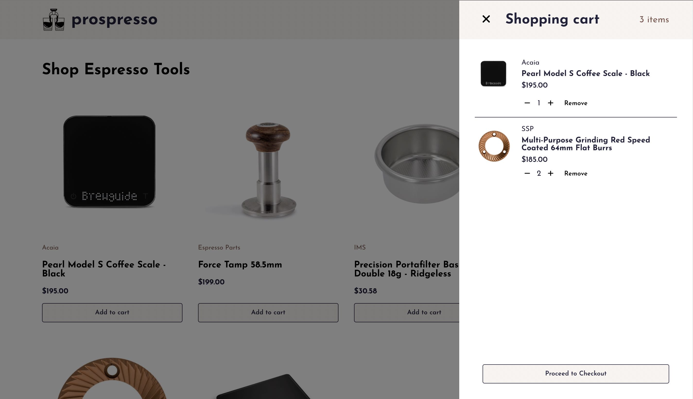

# Online Shop

A fake online shop for <i>prospresso</i>. Equipped with a functional shopping cart and mobile-friendly nav menu.

[Live demo](https://gregolive.github.io/online-shop/) 👈

## Functionality

- Routing via <code>react-router</code> allows users to navigate between home, shop and product pages
- Storage of shopping cart items in the user's browser via <code>localStorage</code>
- On smaller screen sizes (less than 768px) the header navigation is hidden and opened with a menu button on the left side of the header
- The shopping cart slides out from the right side of the screen on click of the cart button and opens when a new item is added
- On the shop page user's can add a product to their cart and a quantity of 1 is used by default
- On a product's page users can use a <code>select</code> input to add a custom quantity of the product to their cart
- In the cart an the quantity of a product can be adjusted with <code>+</code> and <code>-</code> buttons or the item can be removed entirely

## Reflection

I was able to implement routing and testing in react for the first time with this online shop project. 

Routing was acheived by importing functions from <code>react-router</code> and for the most part was fairly straightforward. One issue I ran into was with generating product pages with a product's id. The project uses <code>uniqid</code> to generate id's for the shop's dummy products, but because these are not saved to a database they re-generate on every page load. This meant that when I tried to link to a product via it's id:

````
<Link to={product.id}>
````
the id changed on the page load and <code>useParams()</code> was unable to find the product with matching id. For this reason I opted to link to a profuct by their name, although this creates less appealing urls.

The main difficulty of testing was testing a product's page and supplying a mock product link. Based on a [Testing Library docs section on React Router](https://testing-library.com/docs/example-react-router/) I created the following function to supply a testProduct in <code>MemoryRouter</code>'s <code>initialEntries</code> prop:

````
const renderWithRouter = () => (
  render(
    <MemoryRouter initialEntries={[`/shop/${testProduct.name}`]}>
      <Routes>
        <Route path='/shop/:productName' element={<Product />} />
      </Routes>
    </MemoryRouter>
  )
);
````

## Screenshot

